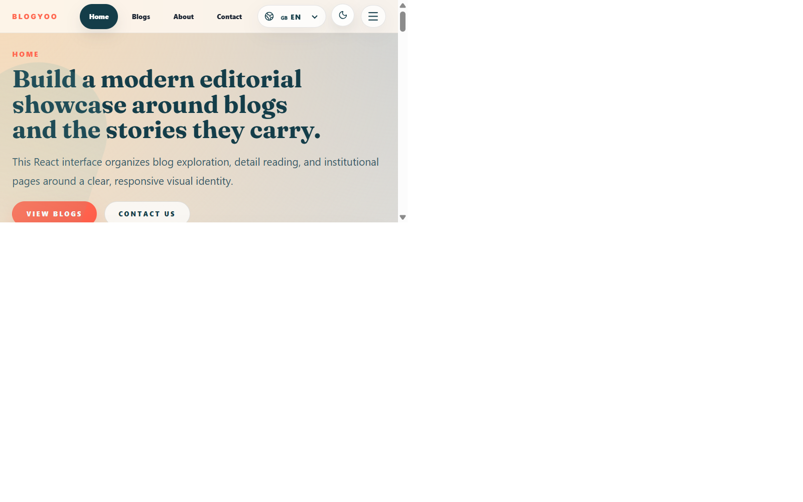
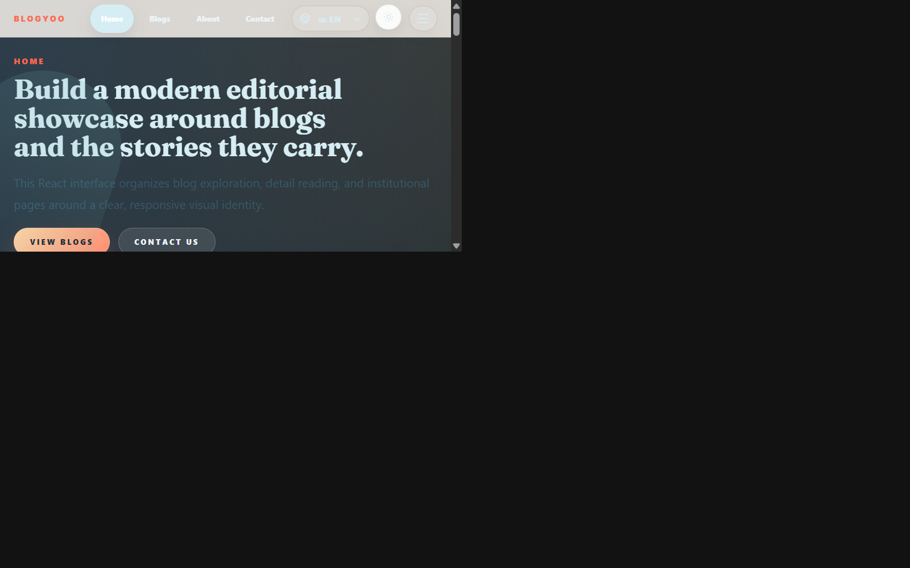
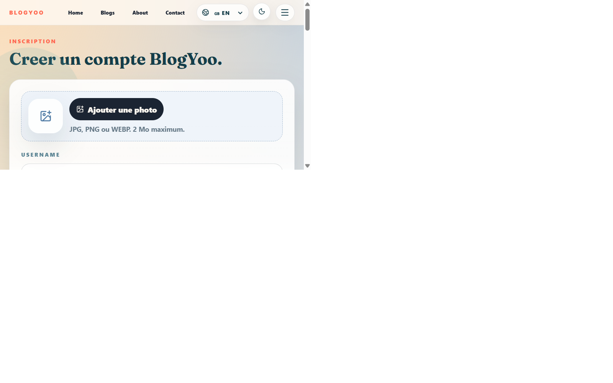
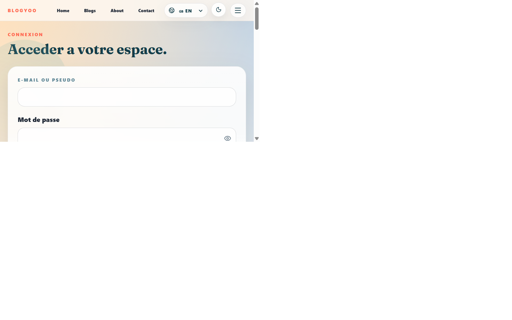
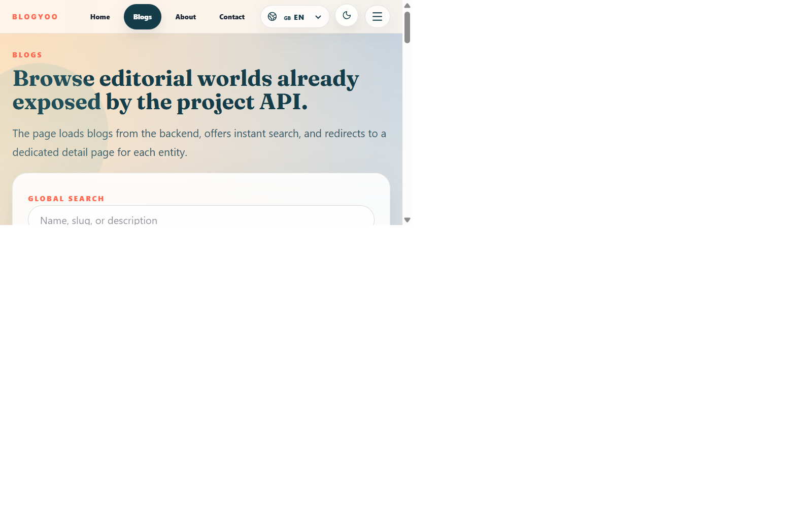
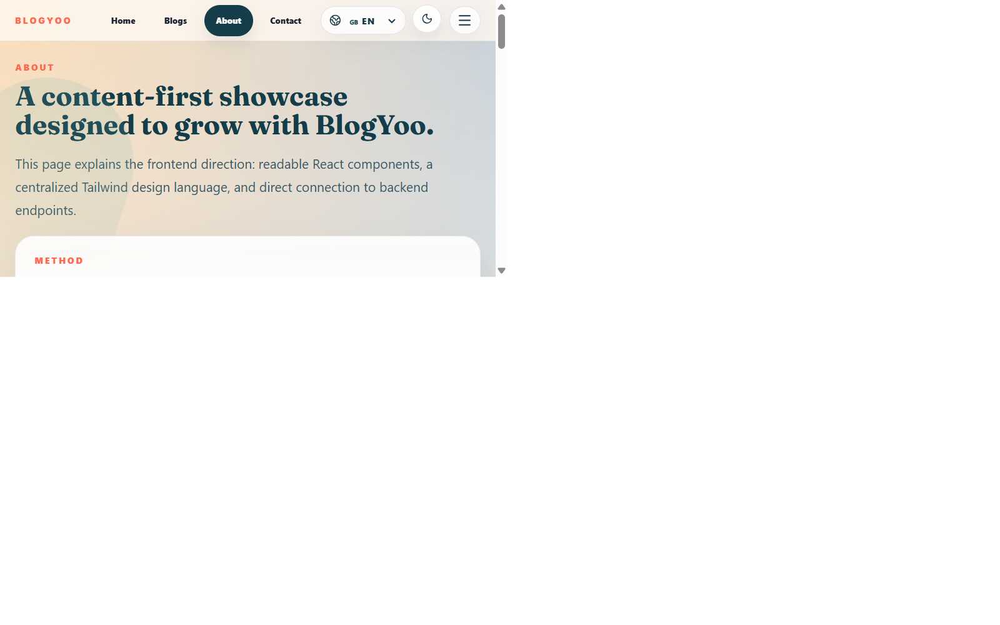
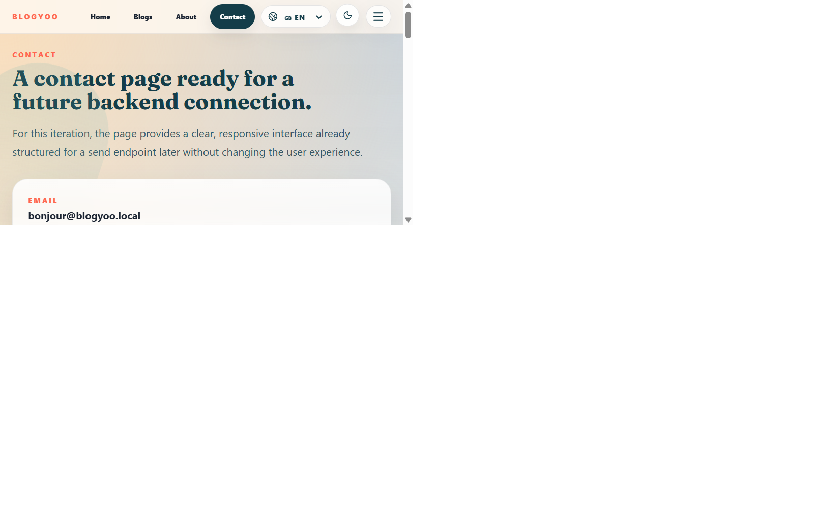
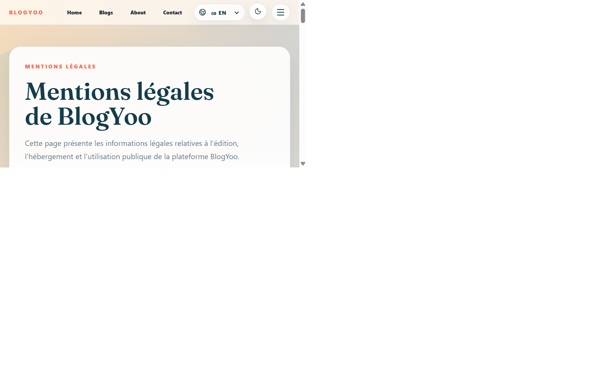
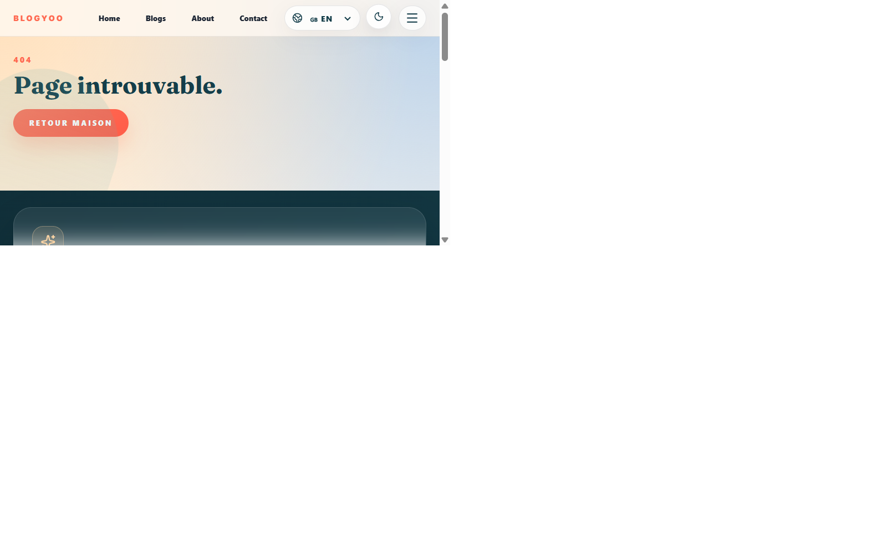
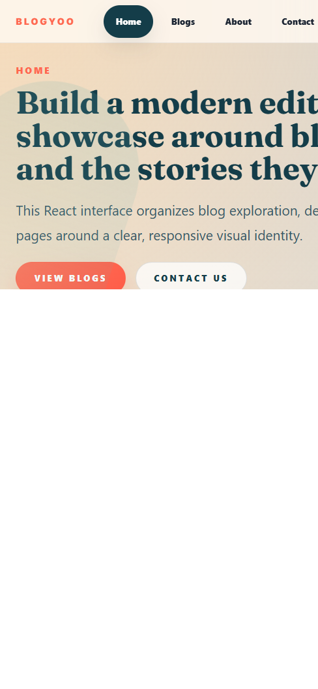

# BlogYoo — Plateforme SaaS de blogging multi-utilisateurs

<div align="center">

[](https://nodejs.org)
[](https://react.dev)
[](https://mysql.com)
[](https://expressjs.com)
[](https://tailwindcss.com)
[](https://vitejs.dev)
[](https://jestjs.io)
[](https://render.com)
[](https://netlify.com)

</div>

---

**BlogYoo** (anciennement *Blog à Part*) est une plateforme SaaS de blogging multi-utilisateurs construite avec **Node.js / Express** côté serveur et **React / Vite** côté client. Elle permet de créer et gérer des blogs indépendants, avec un système de rôles complet (RBAC), une modération des contenus, un gestionnaire de médias et un constructeur de pages visuel.

> Projet développé dans le cadre du titre professionnel **Développeur Web et Web Mobile (DWWM)**.

---

## Table des matières

- [Aperçu visuel](#aperçu-visuel)
- [Architecture](#architecture)
- [Stack technique](#stack-technique)
- [Fonctionnalités](#fonctionnalités)
- [Installation locale](#installation-locale)
- [Variables d'environnement](#variables-denvironnement)
- [Base de données](#base-de-données)
- [Tests](#tests)
- [Déploiement](#déploiement)
- [Sécurité](#sécurité)
- [Documentation complète](#documentation-complète)

---

## Aperçu visuel

### 1. Consentement RGPD — premier chargement

Dès la première visite, une modale de consentement légale s'affiche. L'utilisateur doit accepter les mentions légales, les conditions d'utilisation et la politique de confidentialité avant de pouvoir naviguer.


---

### 2. Page d'accueil — Mode clair

La page d'accueil présente la proposition de valeur de la plateforme avec un hero section, un appel à l'action et une navigation claire. Le design est responsive et multilingue (FR / EN / AR / ES).



---

### 3. Page d'accueil — Mode sombre

Un toggle jour/nuit est accessible depuis la barre de navigation. Le thème sombre utilise des variables CSS définies dans `variables.css` et basculées via un `data-theme` sur le `<html>`.



---

### 4. Inscription — Créer un compte

Le formulaire d'inscription inclut : upload d'avatar (JPG/PNG/WEBP, 2 Mo max), validation côté client et côté serveur, hash argon2id du mot de passe, et acceptation obligatoire des conditions légales.



---

### 5. Connexion — Accéder à son espace

La connexion accepte email ou pseudo. L'API retourne un JWT access token + refresh token. Un rate-limiter protège contre les attaques brute-force (5 tentatives / 15 minutes / IP).



---

### 6. Catalogue de blogs

La page `/blogs` liste tous les blogs publics de la plateforme. Elle intègre une recherche instantanée par nom, slug ou description, et redirige vers la page de détail de chaque blog.



---

### 7. Page À propos

Présentation de la plateforme, de la mission éditoriale et des valeurs du projet.



---

### 8. Page Contact

Formulaire de contact avec validation et protection anti-spam par rate-limiting.



---

### 9. Pages légales — RGPD

Mentions légales, conditions d'utilisation, politique de confidentialité — générées statiquement et liées depuis la modale de consentement.



---

### 10. Page 404 — Route introuvable

Toutes les routes inconnues redirigent vers une page 404 ergonomique avec lien de retour vers l'accueil.



---

### 11. Redirection d'authentification

Les routes protégées (dashboard, espace owner, admin…) redirigent automatiquement vers `/signin`. Après connexion, un redirect ramène vers la page d'origine demandée.


---

### 12. Vue mobile — Responsive design

L'interface est entièrement responsive. Sur mobile, la navigation principale se replie dans un menu hamburger avec animation.



---

## Architecture

```
┌──────────────────────────────────────────────────────────────┐
│                        NAVIGATEUR                             │
│   React 18 · Vite 5 · React Router 7 · Tailwind CSS 4        │
│   Axios · i18next (FR/EN/AR/ES) · Context API                 │
└──────────────────────────┬───────────────────────────────────┘
                           │  HTTP REST / JSON
                           │  Authorization: Bearer <JWT>
                           ▼
┌──────────────────────────────────────────────────────────────┐
│                     SERVEUR NODE.JS                           │
│   Express 4.18 · JWT + Refresh Token · Multer (upload)        │
│   express-rate-limit · CORS · argon2id + bcrypt               │
│   RBAC : admin / owner / editor / author / reader             │
│   14 contrôleurs · 14 fichiers de routes · 3 services        │
└──────────────────────────┬───────────────────────────────────┘
                           │  mysql2/promise (pool de connexions)
                           │  SSL TLS (Filess.io en prod)
                           ▼
┌──────────────────────────────────────────────────────────────┐
│                     BASE DE DONNÉES                           │
│   MySQL 8 · InnoDB · utf8mb4 · ~20 tables                    │
│   Migrations SQL · Seed data · Audit logs                     │
└──────────────────────────────────────────────────────────────┘
```

### Structure des fichiers

```
blog_a_part/
├── backend/
│   ├── src/
│   │   ├── app.js              ← Express + middlewares globaux
│   │   ├── router.js           ← Montage des routes centralisé
│   │   ├── controllers/        ← 14 contrôleurs HTTP
│   │   ├── models/             ← Managers DB (AbstractManager pattern)
│   │   ├── middlewares/        ← auth, permissions, rateLimit, upload
│   │   ├── routes/             ← 14 fichiers de définition de routes
│   │   └── services/           ← AuthService, BuilderService, AdminService
│   ├── database/
│   │   ├── client.js           ← Pool mysql2/promise
│   │   └── *.sql               ← Migrations par feature
│   └── __tests__/              ← 42 tests Jest + Supertest
├── frontend/
│   ├── src/
│   │   ├── App.jsx             ← Routes React Router 7
│   │   ├── components/         ← Composants réutilisables
│   │   ├── pages/              ← Pages par fonctionnalité
│   │   ├── context/            ← AuthContext, ThemeContext…
│   │   ├── hooks/              ← useAuth, useBlog, usePost…
│   │   ├── services/           ← Appels Axios vers l'API
│   │   ├── i18n/               ← Traductions FR/EN/AR/ES
│   │   └── styles/             ← variables.css, layout.css, reset.css
│   └── vite.config.js
└── docs/
    ├── screenshots/            ← Captures d'écran de l'application
    ├── SYNTHESE-JURY.md        ← Synthèse 60 min pour jury DWWM
    └── 01-presentation.md … 10-deploiement.md
```

---

## Stack technique

| Couche | Technologie | Version | Rôle |
|--------|-------------|---------|------|
| **Frontend** | React | 18.2 | Composants UI + état |
| | Vite | 5.4 | Bundler + HMR |
| | React Router | 7 | Navigation SPA |
| | Tailwind CSS | v4 | Utilitaires CSS |
| | i18next | 23 | Internationalisation 4 langues |
| | Axios | 1.x | Requêtes HTTP avec intercepteurs |
| **Backend** | Node.js | 24 LTS | Runtime JavaScript serveur |
| | Express | 4.18 | Framework HTTP |
| | jsonwebtoken | 9.x | Auth JWT access + refresh |
| | argon2 | 0.31 | Hash mots de passe (argon2id) |
| | Multer | 1.x | Upload de fichiers multipart |
| | express-rate-limit | 7.x | Protection brute-force |
| **Base de données** | MySQL | 8.0 | SGBD relationnel |
| | mysql2/promise | 3.x | Driver async avec pool |
| **Tests** | Jest | 29 | Framework de tests |
| | Supertest | 6.x | Tests d'intégration API HTTP |
| **Déploiement** | Netlify | — | Hébergement frontend statique |
| | Render | — | Hébergement backend Node.js |
| | Filess.io | — | MySQL cloud (port 3307, SSL) |

---

## Fonctionnalités

### Authentification et comptes

- Inscription avec upload d'avatar, validation client + serveur
- Connexion par email ou pseudo, JWT access (15 min) + refresh token
- Protection brute-force : rate-limiting 5 requêtes / 15 min / IP
- Réinitialisation de mot de passe sécurisée
- Consentement RGPD obligatoire (3 documents légaux)

### Système de rôles RBAC

| Rôle | Périmètre | Droits principaux |
|------|-----------|-------------------|
| `super_admin` | Global | Accès total, gestion des admins |
| `admin` | Global | Modération, gestion utilisateurs |
| `owner` | Blog | Création et configuration de blogs |
| `editor` | Blog | Publication et modération |
| `author` | Blog | Rédaction et soumission |
| `reader` | Blog | Lecture et commentaires |

### Gestion des blogs

- Création, édition, suppression de blogs
- Thèmes personnalisables (Modern Clean, Classic Serif…)
- Toggle public / privé
- Gestion des membres : invitation, rôles par blog
- Catégories, tags, slugs uniques

### Gestion des articles (workflow éditorial)

```
brouillon (draft)
    └─► soumis (pending)
            ├─► publié (published)   ← validé par editor/owner
            └─► rejeté (rejected)   ← avec motif
```

- Éditeur de contenu riche
- Gestion des commentaires avec modération
- Signalement de contenu (reports)

### Constructeur de pages visuel (Builder)

- Création de pages libres avec blocs visuels configurables
- Configuration JSON stockée en base de données
- Prévisualisation en temps réel

### Gestion des médias

- Upload d'images (JPG, PNG, WEBP — 2 Mo max)
- Galerie de médias par blog
- Stockage local dans `backend/public/uploads/`

### Tableau de bord

- Statistiques par blog (articles, commentaires, membres)
- Notifications et alertes
- Profil utilisateur modifiable (avatar, bio, informations)

### Interface utilisateur

- Multilingue : FR / EN / AR / ES (i18next + lazy loading)
- Mode sombre / clair (CSS custom properties + `data-theme`)
- Responsive mobile-first (menu hamburger, layouts flexibles)
- Page 404 personnalisée + redirections protégées avec retour

---

## Installation locale

### Prérequis

- Node.js 18+ (recommandé : Node.js 24 LTS)
- MySQL 8.0 (ou accès Filess.io)
- Git

### Étape 1 — Cloner le projet

```bash
git clone https://github.com/stephGuill/blog_a_part.git
cd blog_a_part
```

### Étape 2 — Configurer le backend

```bash
cd backend
cp .env.sample .env
```

Éditer `backend/.env` :

```env
DB_HOST=localhost
DB_PORT=3306
DB_USER=root
DB_PASSWORD=
DB_NAME=blog_a_part
JWT_SECRET=votre-secret-jwt-tres-long-minimum-64-caracteres
JWT_REFRESH_SECRET=votre-secret-refresh-tres-long-minimum-64-caracteres
FRONTEND_URL=http://localhost:5173
PORT=5000
```

```bash
npm install
```

### Étape 3 — Créer la base de données

```bash
# Créer la base de données MySQL
mysql -u root -e "CREATE DATABASE IF NOT EXISTS blog_a_part CHARACTER SET utf8mb4 COLLATE utf8mb4_unicode_ci;"

# Lancer les migrations (crée toutes les tables)
node migrate.js

# Optionnel : insérer des données de démonstration
mysql -u root blog_a_part < database/seed.sql
```

### Étape 4 — Démarrer le backend

```bash
npm run dev
# Serveur Express disponible sur http://localhost:5000
```

### Étape 5 — Configurer et démarrer le frontend

```bash
cd ../frontend
cp .env.sample .env
# Le fichier .env contient : VITE_BACKEND_URL=http://localhost:5000
npm install
npm run dev
# Application React disponible sur http://localhost:5173
```

### Étape 6 — Ouvrir l'application

Rendez-vous sur **[http://localhost:5173](http://localhost:5173)**.

La modale RGPD s'affiche au premier chargement. Acceptez les trois documents légaux pour accéder à l'application.

### Scripts utiles (depuis la racine du projet)

```bash
npm run dev        # Démarre frontend + backend en parallèle (concurrently)
npm run dev-front  # Frontend uniquement
npm run dev-back   # Backend uniquement
npm run migrate    # Exécute backend/migrate.js
npm run lint       # Lint frontend + backend
npm run fix        # Auto-correction lint frontend + backend
```

---

## Variables d'environnement

### Backend (`backend/.env`)

| Variable | Description | Exemple |
|----------|-------------|---------|
| `DB_HOST` | Hôte MySQL | `localhost` / `sql.filess.io` |
| `DB_PORT` | Port MySQL | `3306` (local) / `3307` (Filess.io) |
| `DB_USER` | Utilisateur MySQL | `root` |
| `DB_PASSWORD` | Mot de passe MySQL | — |
| `DB_NAME` | Nom de la base | `blog_a_part` |
| `JWT_SECRET` | Secret JWT access token | ≥ 64 caractères aléatoires |
| `JWT_REFRESH_SECRET` | Secret JWT refresh token | ≥ 64 caractères aléatoires |
| `FRONTEND_URL` | URL CORS autorisée | `http://localhost:5173` |
| `PORT` | Port d'écoute Express | `5000` |
| `DB_SSL` | SSL activé (Filess.io) | `true` |

### Frontend (`frontend/.env`)

| Variable | Description | Exemple |
|----------|-------------|---------|
| `VITE_BACKEND_URL` | URL de l'API backend | `http://localhost:5000` |

> Les fichiers `.env.sample` sont versionnés comme templates. Les fichiers `.env` (vraies valeurs) ne sont jamais commités.

---

## Base de données

Le schéma comprend **~20 tables** MySQL 8 / InnoDB / utf8mb4 :

```
users              → comptes utilisateurs, rôles globaux, avatars
blogs              → blogs (owner, thème, slug, public/privé)
blog_members       → membres d'un blog + rôle dans le blog
themes             → thèmes visuels configurables (JSON)
posts              → articles (titre, contenu, statut, auteur)
categories         → catégories par blog
comments           → commentaires sur les posts
reports            → signalements de contenu
media              → fichiers uploadés par blog
items              → blocs de contenu (builder)
pages              → pages libres (builder)
audit_logs         → journal des actions sensibles
user_oauth_accounts→ comptes OAuth (extension possible)
```

### Lancer les migrations

```bash
cd backend

# Migration principale (crée toutes les tables de base)
node migrate.js

# Patches de fonctionnalités (dans l'ordre)
node scripts/apply-auth-security-patch.js
node scripts/apply-builder-patch.js
node scripts/apply-saas-permissions-patch.js
```

---

## Tests

Le projet inclut **42 tests d'intégration** couvrant l'ensemble de l'API REST.

```bash
cd backend
npm test -- --runInBand
```

> `--runInBand` est obligatoire : les tests partagent une base de données MySQL réelle (pas de mocks ni base en mémoire).

### Couverture des tests

| Fichier de test | Ce qui est testé |
|-----------------|-----------------|
| `auth.test.js` | Inscription, connexion, refresh, logout, rate-limiting |
| `blogs.test.js` | CRUD blogs, permissions owner, visibilité |
| `posts.test.js` | CRUD posts, workflow brouillon→publié |
| `categories.test.js` | Gestion des catégories par blog |
| `comments.test.js` | Commentaires + modération |
| `users.test.js` | Profil, avatar, modification des données |
| `media.test.js` | Upload, galerie, suppression |

---

## Déploiement

### Architecture de production

```
Netlify (frontend)              Render (backend)          Filess.io (MySQL)
────────────────────────        ──────────────────────    ──────────────────
Build React statique       ──►  Node.js + Express    ──►  MySQL 8 cloud
CDN mondial                     Web Service auto-scale    Port 3307 + SSL
HTTPS automatique               HTTPS Let's Encrypt       Backups quotidiens
```

### Déployer le frontend sur Netlify

```bash
cd frontend
npm run build
# Déployer le dossier dist/ sur Netlify
```

Configuration Netlify :
- **Build command** : `npm run build`
- **Publish directory** : `dist`
- **Variable** : `VITE_BACKEND_URL=https://votre-api.onrender.com`

Ajouter `frontend/public/_redirects` :
```
/*  /index.html  200
```

### Déployer le backend sur Render

1. Connecter le repo GitHub sur [render.com](https://render.com)
2. Choisir **Web Service** → **Node.js**
3. **Root directory** : `backend`
4. **Build command** : `npm install`
5. **Start command** : `node src/app.js`
6. Ajouter toutes les variables d'environnement (DB_*, JWT_*, FRONTEND_URL)
7. Après déploiement : déclencher `node migrate.js` via le Shell Render

### Base de données cloud Filess.io

```env
DB_HOST=sql.filess.io
DB_PORT=3307
DB_NAME=blog_a_part_xxxxx
DB_USER=blog_a_part_xxxxx
DB_PASSWORD=xxxxxxxxxxxx
DB_SSL=true
```

---

## Sécurité

| Menace | Protection mise en place |
|--------|--------------------------|
| Brute-force login | `express-rate-limit` — 5 req/15 min/IP |
| Injection SQL | Requêtes paramétrées mysql2 (placeholders `?`) |
| XSS | Échappement HTML + CSP header |
| Vol de JWT | Expiration courte (15 min) + rotation refresh token |
| Upload malveillant | Validation MIME type + limite taille (2 Mo) |
| Accès non autorisé | Middlewares `auth.js` + `permissions.js` + RBAC |
| Élévation de privilèges | `requireGlobalRole` + `requireBlogPermission` |
| Mots de passe | argon2id (m=65536, t=3, p=4) — résistant GPU |
| Audit trail | Table `audit_logs` — toutes les actions sensibles |
| CORS | Liste blanche explicite des origines autorisées |

---

## Documentation complète

| Document | Contenu |
|----------|---------|
| [01 — Présentation](docs/01-presentation.md) | Fonctionnalités, public cible, cas d'usage |
| [02 — Installation](docs/02-installation.md) | Mise en place locale pas à pas |
| [03 — Architecture](docs/03-architecture.md) | Structure des fichiers, flux de données |
| [04 — Base de données](docs/04-base-de-donnees.md) | Schéma SQL, relations entre tables |
| [05 — API](docs/05-api.md) | Référence de tous les endpoints REST |
| [06 — Frontend](docs/06-frontend.md) | Pages, composants, routing, contextes |
| [07 — Sécurité](docs/07-securite.md) | JWT, RBAC, rate limiting, CORS, RGPD |
| [08 — Tests](docs/08-tests.md) | Stratégie de test, Jest, Supertest |
| [09 — Docker](docs/09-docker.md) | Conteneurisation, Filess.io, modes de lancement |
| [10 — Déploiement](docs/10-deploiement.md) | Netlify + Render + Filess.io, étape par étape |
| [Synthèse jury DWWM](docs/SYNTHESE-JURY.md) | Présentation orale 60 min — Titre DWWM |

---

## Auteur

**stephGuill** — [github.com/stephGuill/blog_a_part](https://github.com/stephGuill/blog_a_part)

Projet réalisé dans le cadre du titre professionnel **Développeur Web et Web Mobile (DWWM)** — 2024/2026.

---

<div align="center">

*BlogYoo — Build, publish, and grow editorial worlds.*

</div>